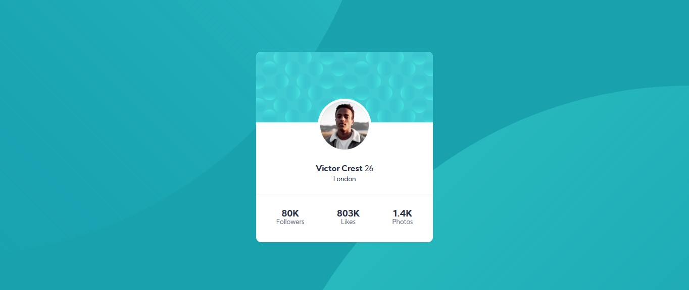

# Frontend Mentor - Profile card component solution

This is a solution to the [Profile card component challenge on Frontend Mentor](https://www.frontendmentor.io/challenges/profile-card-component-cfArpWshJ). Frontend Mentor challenges help you improve your coding skills by building realistic projects. 

## Table of contents

- [Overview](#overview)
  - [The challenge](#the-challenge)
  - [Screenshot](#screenshot)
  - [Links](#links)
- [My process](#my-process)
  - [Built with](#built-with)
  - [What I learned](#what-i-learned)
  - [Continued development](#continued-development)
- [Author](#author)


## Overview

### The challenge

- Build out the project to the designs provided

### Screenshot




### Links

- Solution URL: [Add solution URL here](https://www.frontendmentor.io/solutions/profilecardcomponentmain-html-css-YncF_lD9-)
- Live Site URL: [Add live site URL here](https://ramikoff.github.io/profile-card-component-main/)

## My process

### Built with

- .svg background images
- CSS background-position Property
- Desktop-first workflow


**Note: These are just examples. Delete this note and replace the list above with your own choices**

### What I learned

-Scaling of SVG backgrounds


Some CSS code I'm proud of

```css
.wrapper {
  max-width: 350px;
  position: absolute;
  top: 50%;
  left: 50%;
  margin-right: -50%;
  transform: translate(-50%, -50%)
}

@media screen and (max-width: 800px) and (orientation: Landscape) {
  body {
    background-size: 125%;
    background-position: 270% 55%, -120% -30%;
  }
}

```


### Continued development

I want to continue focusing on: CSS Flex, Grid, mobile first approach and React in future projects. These are concepts i am still not completely comfortable with or techniques i found useful that i want to refine and perfect.


## Author

- Linkedin - [Ramil Novruzov](https://www.linkedin.com/in/ramilnovruzov/)
- Frontend Mentor - [@ramikoff](https://www.frontendmentor.io/profile/ramikoff)


